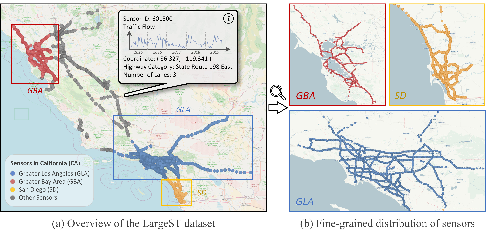

# The LargeST Benchmark Dataset

This is the official repository of our NeurIPS 2023 DB Track paper [LargeST: A Benchmark Dataset for Large-Scale Traffic Forecasting](https://arxiv.org/abs/2306.08259). LargeST comprises four sub-datasets, each characterized by a different number of sensors. The biggest one is California (CA), including a total number of 8,600 sensors. We also construct three subsets of CA by selecting three representative areas within CA and forming the sub-datasets of Greater Los Angeles (GLA), Greater Bay Area (GBA), and San Diego (SD). The figure here shows an illustration.



---

📚 **Documentation:** See [`DOCUMENTATION_INDEX.md`](DOCUMENTATION_INDEX.md) for a complete guide to all available documentation.

In LargeST we also provide comprehensive metadata for all sensors, which are listed below.
| Attribute |                 Description                     |  Possible Range of Values
|   :---    |                    :---                         |          :---
|    ID     |  The identifier of a sensor in PeMS             |  6 to 9 digits number
|    Lat    |  The latitude of a sensor                       |  Real number
|    Lng    |  The longitude of a sensor                      |  Real number
|  District |  The district of a sensor in PeMS               |  3, 4, 5, 6, 7, 8, 10, 11, 12
|   County  |  The county of a sensor in California           |  String
|    Fwy    |  The highway where a sensor is located          |  String starts with 'I', 'US', or 'SR'
|    Lane   |  The number of lanes where a sensor is located  |  1, 2, 3, 4, 5, 6, 7, 8
|    Type   |  The type of a sensor                           |  Mainline
| Direction |  The direction of the highway                   |  N, S, E, W


## 1. Data Preparation

📖 **Quick Start:** See [`QUICKSTART.md`](QUICKSTART.md) for essential commands only.

In this section, we will outline the procedure for preparing the CA dataset, followed by an explanation of how the GLA, GBA, and SD datasets can be derived from CA. The data is organized into two main folders:

- **`data/`**: Contains raw data and processed datasets for baseline model training
- **`data/gift_eval_datasets/`**: Contains processed datasets specifically formatted for GIFT evaluation framework

Please follow these instructions step by step.

### 1.1 Download the CA Dataset
We host the CA dataset on Kaggle: https://www.kaggle.com/datasets/liuxu77/largest. There are a total of 7 files in this link. Among them, 5 files in .h5 format contain the traffic flow raw data from 2017 to 2021, 1 file in .csv format provides the metadata for all sensors, and 1 file in .npy format represents the adjacency matrix constructed based on road network distances.

- **If you are using the web user interface**, you can download all data from the provided [link](https://www.kaggle.com/datasets/liuxu77/largest). The download button is at the upper right corner of the webpage. Then please place the downloaded archive.zip file in the `data/ca` folder and unzip the file.

- **If you would like to use the Kaggle API**, please follow the instructions [here](https://github.com/Kaggle/kaggle-api). After setting the API correctly, you can simply go to the `data/ca` folder, and use the command below to download all data.
```
kaggle datasets download liuxu77/largest
```

Note that the traffic flow raw data of the CA dataset require additional processing (described in Section 1.2 and 1.3), while the metadata and adjacency matrix are ready to be used.

### 1.2 Process Traffic Flow Data of CA
We provide a jupyter notebook `process_ca_his.ipynb` in the folder `data_analysis/ca` to process and generate a cleaned version of the flow data. Please go through this notebook.

### 1.3 Generate Traffic Flow Data for Baseline Model Training
Please go to the `data_analysis` folder, and use the command below to generate the flow data for baseline model training in our manuscript.
```
python generate_data_for_training.py --dataset ca --years 2019
```
The processed data are stored in `data/ca/2019`. We also support the utilization of data from multiple years. For example, changing the years argument to 2018_2019 to generate two years of data.

### 1.4 Generate Other Sub-Datasets
We describe the generation of the GLA dataset as an example. Please first go through all the cells in the provided jupyter notebook `generate_gla_dataset.ipynb` in the folder `data_analysis/gla`. Then, use the command below to generate traffic flow data for model training.
```
python generate_data_for_training.py --dataset gla --years 2019
```

### 1.5 Generate Data for GIFT Evaluation
To evaluate foundation models using the GIFT framework, you need to generate a separate set of processed datasets. These datasets are stored in the `data/gift_eval_datasets/` directory and are formatted as HuggingFace Arrow datasets for compatibility with GIFT.

Please go to the `data_analysis` folder and use the command below:
```bash
python generate_data_for_gift_eval.py --dataset ca --years 2019 --freq 15T --tod 1 --dow 1 --overwrite
```

**Arguments:**
- `--dataset`: Dataset name (ca, gla, gba, or sd)
- `--years`: Years to use (e.g., 2019 or 2018_2019 for multiple years)
- `--freq`: Sampling frequency in pandas offset format (e.g., 15T for 15 minutes, 1H for 1 hour)
- `--tod`: Include time-of-day features (1 for yes, 0 for no)
- `--dow`: Include day-of-week features (1 for yes, 0 for no)
- `--output_dir`: Output directory (default: ./gift_eval_datasets)
- `--overwrite`: Overwrite existing dataset if it exists

The processed GIFT evaluation dataset will be saved to `data/gift_eval_datasets/{dataset}/{years}/{freq}/`.

**Example for other datasets:**
```bash
# Generate GLA dataset for GIFT evaluation
python generate_data_for_gift_eval.py --dataset gla --years 2019 --freq 15T --overwrite

# Generate GBA dataset with hourly frequency
python generate_data_for_gift_eval.py --dataset gba --years 2019 --freq 1H --overwrite

# Generate SD dataset using multiple years
python generate_data_for_gift_eval.py --dataset sd --years 2018_2019 --freq 15T --overwrite
```


## 2. Experiments Running
We conduct experiments on an Intel(R) Xeon(R) Gold 6140 CPU @ 2.30 GHz, 376 GB RAM computing server, equipped with an NVIDIA RTX A6000 GPU with 48 GB memory. We adopt PyTorch 1.12 as the default deep learning library. Currently, there are a total of 12 supported baselines in this repository, namely, Historical Last (HL), LSTM, [DCRNN](https://github.com/chnsh/DCRNN_PyTorch), [AGCRN](https://github.com/LeiBAI/AGCRN), [STGCN](https://github.com/hazdzz/STGCN), [GWNET](https://github.com/nnzhan/Graph-WaveNet), [ASTGCN](https://github.com/guoshnBJTU/ASTGCN-r-pytorch), [STTN](https://github.com/xumingxingsjtu/STTN), [STGODE](https://github.com/square-coder/STGODE), [DSTAGNN](https://github.com/SYLan2019/DSTAGNN), [DGCRN](https://github.com/tsinghua-fib-lab/Traffic-Benchmark/tree/master/methods/DGCRN), and [D2STGNN](https://github.com/zezhishao/D2STGNN).

To reproduce the benchmark results in the manuscript, please go to `experiments/baseline_you_want_to_run`, open the provided `run.sh` file, and uncomment the line you would like to execute. Note that you may need to specify the GPU card number on your server. Moreover, we use the flow data from 2019 for model training in our manuscript, if you want to use multiple years of data, please change the years argument to, e.g., 2018_2019.

To run the LSTM baseline, for example, you may execute this command in the terminal:
```
bash experiments/lstm/run.sh
```
or directly execute the Python file in the terminal:
```
python experiments/lstm/main.py --device cuda:2 --dataset SD --years 2019 --model_name lstm --seed 2023 --bs 64
```


## 3. Evaluate Your Model in Three Steps
You may first go through the implementations of various baselines in our repository, which may serve as good references for experimenting your own model. The detailed steps are described as follows.
- The first step is to define the model architecture, and place it into `src/models`. To ensure compatibility with the existing framework, it is recommended that your model inherits the BaseModel class (implemented in `src/base/model.py`).
- If your model does not require any special training or testing procedures beyond the standard workflow provided by the BaseEngine class (implemented in `src/base/engine.py`), you can directly use it for training and evaluation. Otherwise, please include a file in the folder `src/engines`.
- To integrate your model and engine files, you need to create a `main.py` file in the `experiments/your_model_name` directory.


## 4. License \& Acknowledgement
The LargeST benchmark dataset is released under a CC BY-NC 4.0 International License: https://creativecommons.org/licenses/by-nc/4.0. Our code implementation is released under the MIT License: https://opensource.org/licenses/MIT. The license of any specific baseline methods used in our codebase should be verified on their official repositories. Here we would also like to express our gratitude to the authors of baselines for releasing their code.


## 5. Running Foundation Models (Chronos)

For instructions on running Chronos-1, Chronos-Bolt, and Chronos-2 foundation models on the LargeST dataset:

📖 **Quick Reference:** [`QUICKSTART.md`](QUICKSTART.md) - Essential commands only

📖 **Detailed Guide:** [`RUNNING_FOUNDATION_MODELS.md`](RUNNING_FOUNDATION_MODELS.md) - Complete instructions with:
- Full data preparation pipeline
- Step-by-step model running instructions
- Environment setup and configuration
- Troubleshooting common issues
- Path references and directory structure

📖 **Chronos-Specific:** [`gift-eval/README_CHRONOS.md`](gift-eval/README_CHRONOS.md) - Quick reference for Chronos models

## 6. Citation
If you find our work useful in your research, please cite:
```
@inproceedings{liu2023largest,
  title={LargeST: A Benchmark Dataset for Large-Scale Traffic Forecasting},
  author={Liu, Xu and Xia, Yutong and Liang, Yuxuan and Hu, Junfeng and Wang, Yiwei and Bai, Lei and Huang, Chao and Liu, Zhenguang and Hooi, Bryan and Zimmermann, Roger},
  booktitle={Advances in Neural Information Processing Systems},
  year={2023}
}

```
