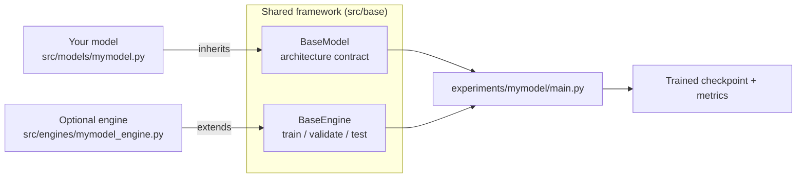

# TrafficFM — A Benchmark for Large-Scale Traffic Forecasting

**TrafficFM** benchmarks and compares heterogeneous families of time-series
models — **Graph Neural Networks (GNNs)**, **Time-Series Foundation Models**,
**State Space Models (SSMs / Mamba)**, and classical **statistical / recurrent
baselines** — on the same footing, using the large-scale
[**LargeST**](https://arxiv.org/abs/2306.08259) traffic dataset.

LargeST comprises four sub-datasets of increasing scale, the largest being
California (**CA**) with **8,600 sensors**. Three representative regions are
carved out of CA to form Greater Los Angeles (**GLA**), Greater Bay Area
(**GBA**), and San Diego (**SD**), enabling a controlled study of how each model
family scales as the sensor network grows.


---

## Why this benchmark?

Traffic forecasting research is fragmented: GNNs are tuned on small graphs,
foundation models are evaluated zero-shot on generic corpora, and SSMs are
tested on synthetic long-range tasks. TrafficFM puts them under **one data
pipeline, one evaluation protocol, and one set of metrics** so their trade-offs
in accuracy, scalability, and inference cost become directly comparable.

| Model family | Paradigm | Spatial modeling | Example methods |
| :--- | :--- | :--- | :--- |
| **Classical / Recurrent** | Statistical & RNN | None / implicit | Historical Last (HL), LSTM |
| **Graph Neural Networks** | Spatio-temporal GNN | Explicit graph | DCRNN, AGCRN, STGCN, GWNET, ASTGCN, STTN, STGODE, DSTAGNN, DGCRN, D2STGNN |
| **Foundation Models** | Pretrained, zero/few-shot | Channel-independent | TimesFM, Moirai, Chronos, Timer (via GIFT-Eval) |
| **State Space Models** | Linear-time sequence | Optional graph mixing | SSM-family sequence models |

---

## Benchmark pipeline

```mermaid
flowchart TD
    A["Raw PeMS traffic flow<br/>(CA, 2017-2021, .h5)"] --> B["Clean &amp; process<br/>process_ca_his.ipynb"]
    B --> C["generate_data_for_training.py<br/>--dataset {ca,gla,gba,sd} --years 2019"]
    C --> D{"Model family"}

    D -->|"GNN / RNN / classical"| E["Training framework<br/>experiments/&lt;model&gt;/main.py"]
    D -->|"Foundation models"| F["generate_data_for_gift_eval.py<br/>&#8594; Arrow / GIFT-Eval format"]
    D -->|"SSM"| E

    E --> G["BaseModel + BaseEngine<br/>(src/base)"]
    F --> H["Zero / few-shot eval<br/>(GIFT-Eval harness)"]

    G --> I["Unified metrics<br/>MAE · RMSE · MAPE"]
    H --> I
    I --> J["Leaderboard across<br/>SD &#8594; GBA &#8594; GLA &#8594; CA"]

    classDef data fill:#e3f2fd,stroke:#1565c0,color:#0d47a1;
    classDef proc fill:#fff3e0,stroke:#e65100,color:#bf360c;
    classDef eval fill:#e8f5e9,stroke:#2e7d32,color:#1b5e20;
    class A,B,C,F data;
    class E,G,H proc;
    class I,J eval;
```



The forecasting task is fixed across all models: given the previous
**12 steps** (`--seq_len 12`, 3 hours at 15-minute resolution), predict the next
**12 steps** (`--horizon 12`).

---

## Repository structure

```
TrafficFM/
├── data/                            # Data preparation
│   ├── ca/ gla/ gba/ sd/            # Per-region raw + processed data
│   ├── generate_data_for_training.py     # Build training tensors for GNN/RNN/SSM
│   └── generate_data_for_gift_eval.py    # Export Arrow datasets for foundation models
├── src/
│   ├── base/                        # BaseModel (model.py) + BaseEngine (engine.py)
│   ├── models/                      # Model architectures (agcrn, dcrnn, gwnet, ...)
│   ├── engines/                     # Custom train/test loops where needed
│   └── utils/                       # args, dataloader, metrics, graph_algo, logging
├── experiments/                     # One folder per model, each with main.py + run.sh
│   ├── hl/ lstm/                    # Classical / recurrent
│   ├── dcrnn/ agcrn/ stgcn/ gwnet/  # GNNs
│   ├── astgcn/ sttn/ stgode/ ...
│   └── ...
└── img/overview.png
```



---

## 1. Data preparation

We outline preparing the **CA** dataset; GLA, GBA, and SD are derived from it.

### 1.1 Download CA
The CA dataset is hosted on Kaggle:
<https://www.kaggle.com/datasets/liuxu77/largest>. It contains 5 `.h5` files
(traffic flow, 2017–2021), 1 `.csv` (sensor metadata), and 1 `.npy` (adjacency
matrix built from road-network distances).

Place the downloaded `archive.zip` in `data/ca` and unzip, or use the Kaggle API:
```bash
cd data/ca
kaggle datasets download liuxu77/largest
```
The metadata and adjacency matrix are ready to use; the raw flow data need
processing (Sections 1.2–1.3).

### 1.2 Process CA flow data
Run through the notebook `data/ca/process_ca_his.ipynb` to produce a cleaned
version of the flow data.

### 1.3 Generate training data
```bash
cd data
python generate_data_for_training.py --dataset ca --years 2019
```
Output is written to `data/ca/2019`. Multiple years are supported, e.g.
`--years 2018_2019`.

### 1.4 Generate other sub-datasets
Using GLA as an example, run all cells in `data/gla/generate_gla_dataset.ipynb`,
then:
```bash
python generate_data_for_training.py --dataset gla --years 2019
```

### 1.5 Export data for foundation models
To evaluate pretrained foundation models under the
[GIFT-Eval](https://github.com/SalesforceAIResearch/gift-eval) protocol, export
the flow series to the Arrow / GIFT-Eval format:
```bash
cd data
python generate_data_for_gift_eval.py \
  --dataset ca --years 2019 --freq 15T --tod 1 --dow 1 \
  --output_dir ./gift_eval_datasets
```
Flags `--tod` / `--dow` add time-of-day and day-of-week covariates. The
resulting Arrow dataset can be fed directly to foundation-model harnesses
(TimesFM, Moirai, Chronos, Timer, etc.) for zero/few-shot forecasting.

---

## 2. Running experiments

Reference environment: Intel Xeon Gold 6140 CPU, 376 GB RAM, one NVIDIA RTX
A6000 (48 GB), PyTorch 1.12. The repository ships **12 trainable baselines**:
Historical Last (HL), LSTM,
[DCRNN](https://github.com/chnsh/DCRNN_PyTorch),
[AGCRN](https://github.com/LeiBAI/AGCRN),
[STGCN](https://github.com/hazdzz/STGCN),
[GWNET](https://github.com/nnzhan/Graph-WaveNet),
[ASTGCN](https://github.com/guoshnBJTU/ASTGCN-r-pytorch),
[STTN](https://github.com/xumingxingsjtu/STTN),
[STGODE](https://github.com/square-coder/STGODE),
[DSTAGNN](https://github.com/SYLan2019/DSTAGNN),
[DGCRN](https://github.com/tsinghua-fib-lab/Traffic-Benchmark/tree/master/methods/DGCRN),
and [D2STGNN](https://github.com/zezhishao/D2STGNN).

Each model has a `run.sh` in `experiments/<model>/`; uncomment the line you want
and set the GPU id. For example:
```bash
bash experiments/lstm/run.sh
```
or run `main.py` directly:
```bash
python experiments/lstm/main.py \
  --device cuda:0 --dataset SD --years 2019 \
  --model_name lstm --seed 2023 --bs 64
```

Common arguments (`src/utils/args.py`): `--dataset {SD,GBA,GLA,CA}`,
`--years`, `--seq_len 12`, `--horizon 12`, `--bs`, `--max_epochs`,
`--patience`, `--mode {train,test}`.

---

## 3. Adding your own model in three steps

The framework is designed for plugging in new architectures — including SSM /
Mamba variants — with minimal boilerplate.

1. **Define the architecture** in `src/models/` and inherit `BaseModel`
   (`src/base/model.py`) for compatibility.
2. **(Optional) Add an engine** in `src/engines/` if training/testing deviates
   from the standard `BaseEngine` (`src/base/engine.py`).
3. **Wire it up** with a `main.py` in `experiments/<your_model>/`.

Existing baselines are good references for each step.

---

## 4. Evaluation metrics

All models are scored with masked **MAE**, **RMSE**, and **MAPE**
(`src/utils/metrics.py`), computed per horizon step and averaged, with a
null-value mask so missing sensor readings do not distort the results. Reporting
across SD → GBA → GLA → CA reveals how each model family trades off accuracy
against network scale and inference cost.

---

## 5. License & acknowledgement

The LargeST dataset is released under
[CC BY-NC 4.0](https://creativecommons.org/licenses/by-nc/4.0); the code is
released under the [MIT License](https://opensource.org/licenses/MIT). Licenses
for individual baselines should be checked in their official repositories. We
thank the authors of all baselines for releasing their code.

---

## 6. Citation

If you find this work useful, please cite LargeST:
```bibtex
@inproceedings{liu2023largest,
  title={LargeST: A Benchmark Dataset for Large-Scale Traffic Forecasting},
  author={Liu, Xu and Xia, Yutong and Liang, Yuxuan and Hu, Junfeng and Wang, Yiwei and Bai, Lei and Huang, Chao and Liu, Zhenguang and Hooi, Bryan and Zimmermann, Roger},
  booktitle={Advances in Neural Information Processing Systems},
  year={2023}
}
```